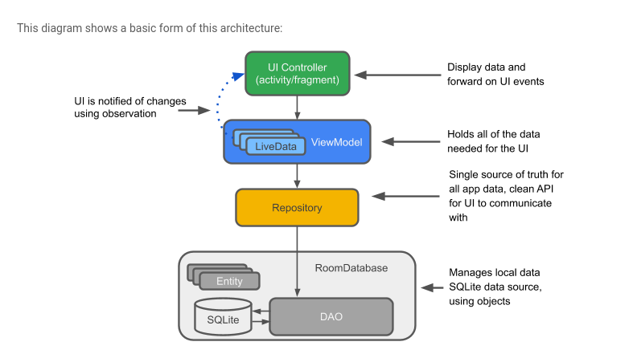
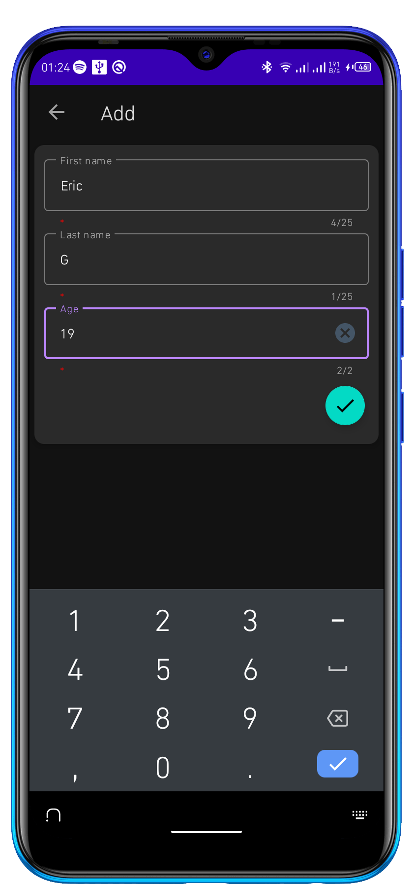
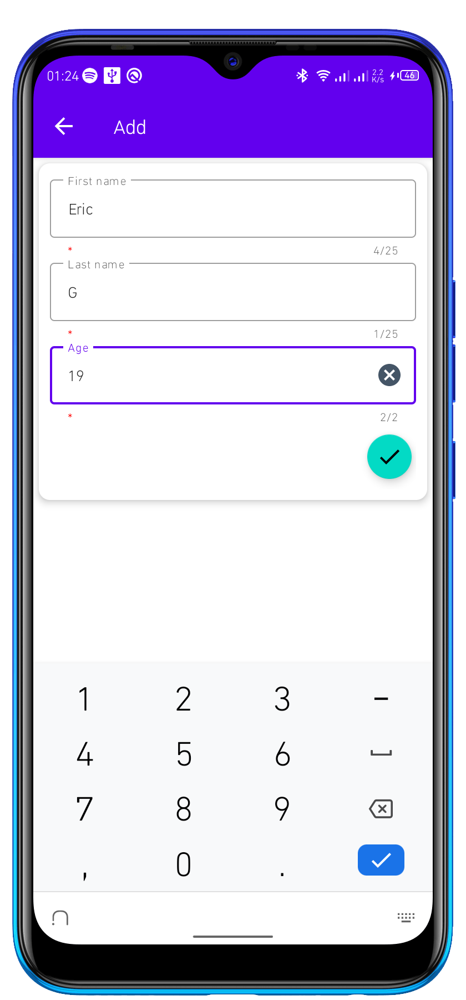
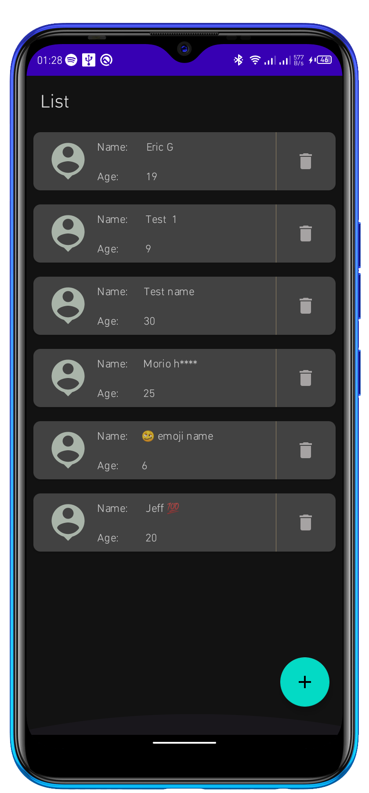
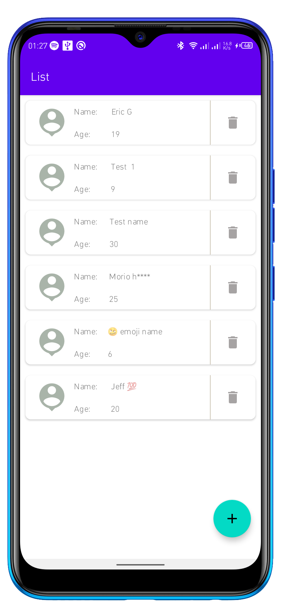
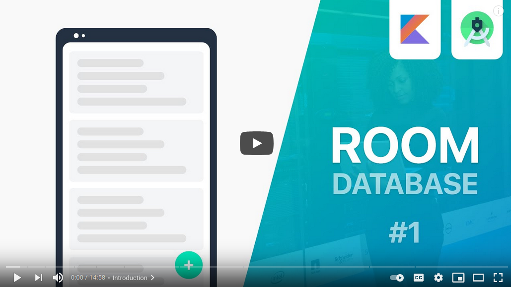

# Room 

`NB: Use wide screen/landscape mode for best view`

### Jetpack-journey - Implementing `Room` [Database](https://developer.android.com/training/data-storage/room) in Android

### Database structure

### App Screenshots (as of v1.0.0)

 

## Tech Guide
... in progress

## Recommended Learning sources

Other than the [official documentation](https://developer.android.com/training/data-storage/room) I think the following can help you unwrap the magic going on here!

### 1. `YouTube` (my all time campus 🤤🤤)

- [Room Database series](https://www.youtube.com/watch?v=lwAvI3WDXBY&list=PLSrm9z4zp4mEPOfZNV9O-crOhoMa0G2-o) by [@stevedza-san](https://github.com/stevdza-san)

### 2. `Codelabs`

- [17-in-1 Codelabs Tutorial](https://developer.android.com/codelabs/android-room-with-a-view-kotlin#0)

